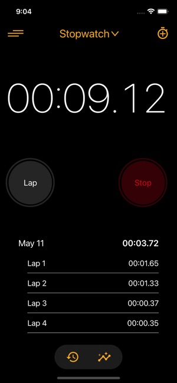

# Stopwatch App

A modern, cross-platform stopwatch application built with Flutter that provides precise time tracking and lap management capabilities.



## Features

- **Precise Time Tracking**: Accurate stopwatch functionality with millisecond precision
- **Lap Management**: 
  - Record and track multiple laps
  - View lap times in chronological order
  - See total number of recorded laps
- **Intuitive Controls**:
  - Start/Stop functionality
  - Lap recording
  - Reset capability
- **Cross-Platform Support**: Available on:
  - Android
  - iOS
  - Windows
  - macOS
  - Linux
  - Web

## Getting Started

### Prerequisites

- Flutter SDK (version >=3.2.0)
- Dart SDK (version >=3.2.0)
- Android Studio / VS Code with Flutter extensions
- Git

### Installation

1. Clone the repository:
   ```bash
   git clone https://github.com/yourusername/stopwatch.git
   cd stopwatch
   ```

2. Install dependencies:
   ```bash
   flutter pub get
   ```

3. Run the app:
   ```bash
   flutter run
   ```

### Usage

1. Launch the app on your preferred platform
2. Use the main control buttons:
   - **Start**: Begin timing
   - **Stop**: Pause timing
   - **Lap**: Record a lap time (available while timing is active)
   - **Reset**: Clear all recorded times and laps

## Development

### Project Structure

```
stopwatch/
├── lib/
│   ├── main.dart          # Application entry point
│   └── src/
│       └── home.dart      # Main stopwatch implementation
├── test/                  # Test files
├── android/              # Android-specific files
├── ios/                  # iOS-specific files
├── web/                  # Web-specific files
├── windows/              # Windows-specific files
├── macos/                # macOS-specific files
└── linux/                # Linux-specific files
```

### Dependencies

- Flutter SDK
- cupertino_icons: ^1.0.2
- flutter_lints: ^2.0.0 (dev dependency)

### Building for Production

To create a production build for your target platform:

```bash
# For Android
flutter build apk

# For iOS
flutter build ios

# For Web
flutter build web

# For Windows
flutter build windows

# For macOS
flutter build macos

# For Linux
flutter build linux
```

## Contributing

1. Fork the repository
2. Create your feature branch (`git checkout -b feature/AmazingFeature`)
3. Commit your changes (`git commit -m 'Add some AmazingFeature'`)
4. Push to the branch (`git push origin feature/AmazingFeature`)
5. Open a Pull Request

## License

This project is licensed under the MIT License - see the [LICENSE](LICENSE) file for details.

## Acknowledgments

- Built with [Flutter](https://flutter.dev/)
- Icons provided by [Cupertino Icons](https://pub.dev/packages/cupertino_icons)
